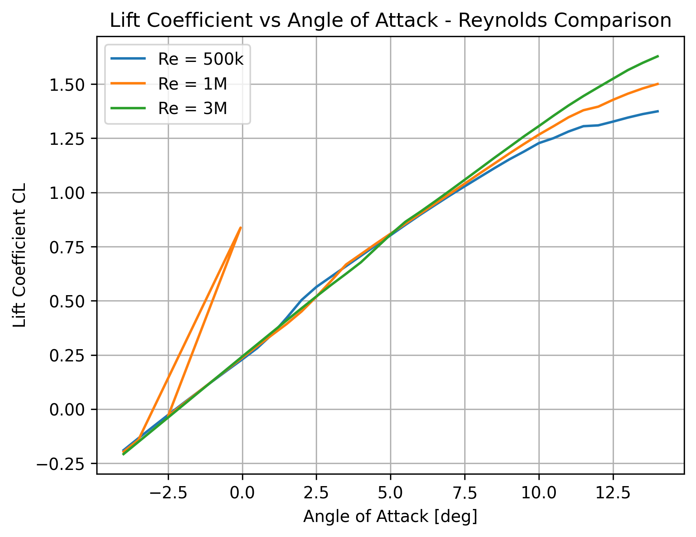
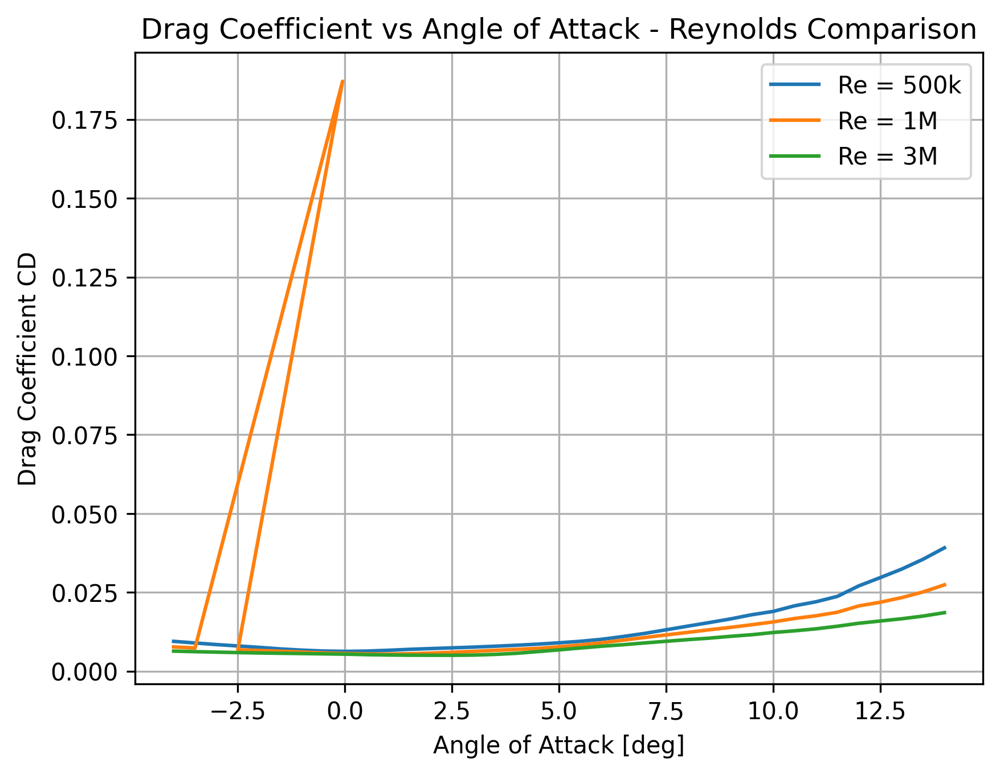
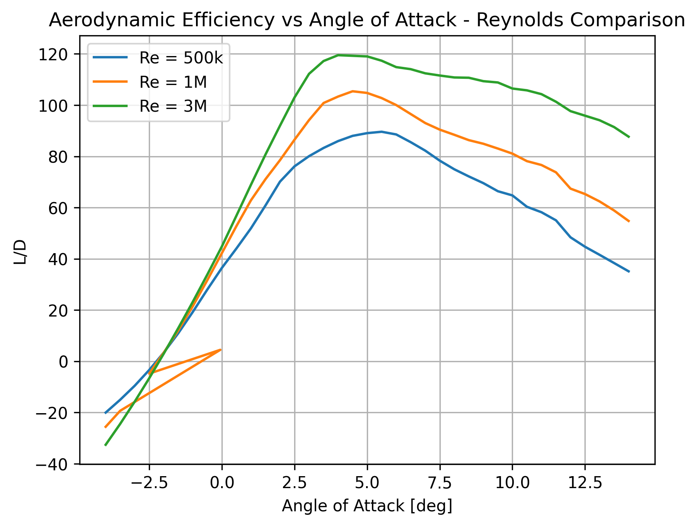

# NACA 2412 Aerodynamic Analysis

Aerodynamic performance analysis of the NACA 2412 airfoil using XFLR5, Excel and Python.

The project investigates the influence of the Reynolds number on lift, drag and aerodynamic efficiency.

## Objectives

- Analyze the NACA 2412 airfoil over a range of angles of attack
- Evaluate lift coefficient (CL) and drag coefficient (CD)
- Calculate aerodynamic efficiency (L/D)
- Identify the angle of attack corresponding to maximum L/D
- Compare aerodynamic performance at different Reynolds numbers
- Convert aerodynamic coefficients into lift, drag and drag power for a reference flight condition

## Tools

- XFLR5 / XFoil
- Python
  - pandas
  - NumPy
  - Matplotlib
- Microsoft Excel
- GitHub

## Simulation Setup

Airfoil: NACA 2412

Angle of attack:

-4° to 14°

Reynolds numbers analyzed:

- 500,000
- 1,000,000
- 3,000,000

## Main Results

| Reynolds number | Maximum L/D | Optimal angle of attack |
|---:|---:|---:|
| 500,000 | 89.6 | 5.5° |
| 1,000,000 | 105.4 | 4.5° |
| 3,000,000 | 119.5 | 4.0° |

The analysis shows that aerodynamic efficiency increases with Reynolds number, while the angle corresponding to maximum L/D slightly decreases.

## Reynolds Number Comparison

### Lift Coefficient

### Drag Coefficient

### Aerodynamic Efficiency

## Python Analysis

Python was used to:

- import XFLR5 aerodynamic data
- calculate L/D automatically
- identify maximum aerodynamic efficiency
- determine the corresponding angle of attack
- calculate lift and drag forces
- estimate the power required to overcome aerodynamic drag
- compare multiple Reynolds-number conditions
- generate publication-quality plots

The complete workflow is available in the Jupyter notebook included in this repository.

## Project Files

- `NACA2412_analysis.ipynb` — complete Python analysis
- `NACA2412_All_Reynolds.csv` — combined aerodynamic dataset
- `NACA2412.xlsx` — Excel calculations and charts
- `CL_Reynolds_Comparison.png` — lift comparison
- `CD_Reynolds_Comparison.png` — drag comparison
- `LD_Reynolds_Comparison.png` — aerodynamic efficiency comparison

## Key Takeaway

For the analyzed conditions, increasing Reynolds number improves the aerodynamic efficiency of the NACA 2412 airfoil. The maximum L/D increases from approximately 89.6 at Re = 500,000 to 119.5 at Re = 3,000,000.
